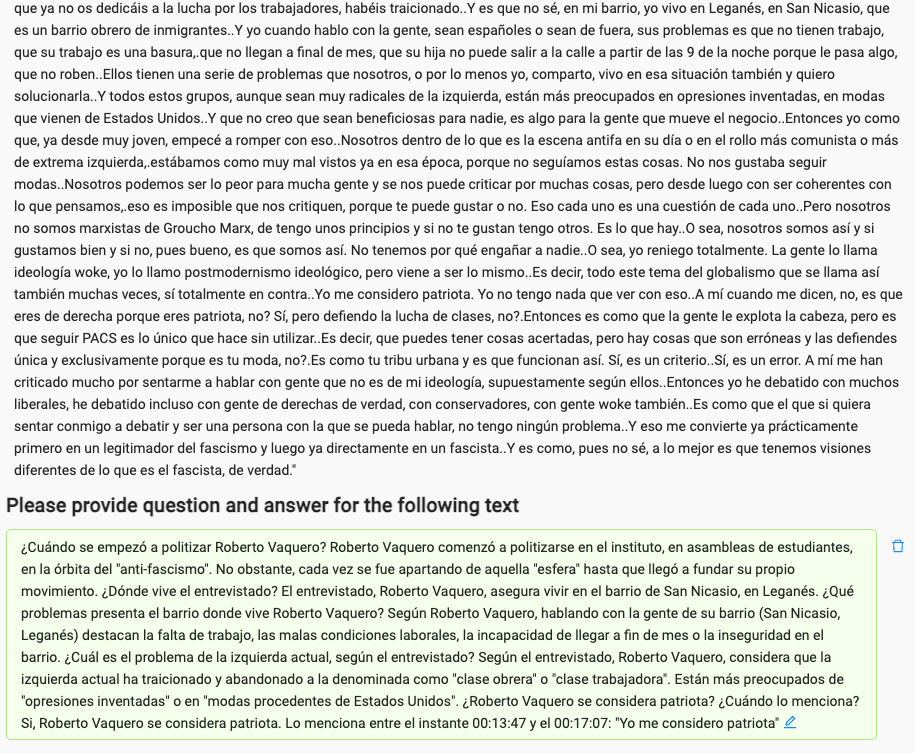

# Castena: LLM Chatbot for Interacting with Spanish Podcasts

<p align="center">
    
</p>

## Table of Contents
- [Introduction](#introduction)
- [Features](#features)
- [Getting Started](#getting-started)
  - [Prerequisites](#prerequisites)
  - [Installation](#installation)
- [Usage](#usage)
- [Evaluation](#evaluation)
- [Contributing](#contributing)
- [License](#license)

## Introduction

The LLM Chatbot for Interacting with Spanish Podcasts is an AI-powered chatbot designed to enhance your podcast listening experience. It is specifically tailored for Spanish-speaking podcast enthusiasts who want to engage with and learn from their favorite Spanish podcasts in a whole new way.

This chatbot utilizes advanced natural language processing techniques to provide real-time text-based interactions with Spanish podcasts. Whether you want to generate transcripts, summarize episodes, or seek information about specific topics within a podcast, this chatbot is here to assist you.

## Our main objectives

<p align="center">
    <a href="https://www.youtube.com/">
        
    </a>
    <a href="https://www.youtube.com/">
        
    </a>
    <a href="https://www.youtube.com/">
        
    </a>
    <a href="https://www.youtube.com/">
        
    </a>
</p>


## Features

- **Transcription**: Get accurate text transcriptions of podcast episodes.
- **Summarization**: Receive concise summaries of podcast episodes.
- **Search**: Find specific information, keywords, or topics within podcasts.
- **Language Support**: Currently designed only to interact in English, translating the outputs into Spanish (Spanish based LLM models will be available soon...).

## Getting Started

### Prerequisites

Before you begin, ensure you have the following requirements in place:

- **Python**: You need Python 3.7 or later installed on your system.
- **Virtual Environment (Optional)**: It's recommended to create a virtual environment to manage dependencies.
- **GPU**: not mandatory, but recommended (GPU used: Nvidia T4)

### Installation

1. Clone the repository:

   ```bash
   git clone https://github.com/AlbertoUAH/Castena.git
   cd Castena
   ```

2. Install the required Python packages:

   ```bash
   pip install -r requirements.txt
   ```

## Usage

  1. Launch the chatbot using the instructions in the "Installation" section.
  
  2. The chatbot will prompt you to enter the podcast name or URL you want to interact with.
  
  3. Choose one of the available interaction options, such as transcription, summarization, or search.
  
  4. Follow the chatbot's prompts to provide additional details or requests.
  
  5. Enjoy your enhanced podcast experience!

## Evaluation

To evaluate our approach, labelled datasets are needed. To do so, we employ [Label Studio library](https://labelstud.io/)

<p align="center">
 
</p>

<p align="center">
 
</p>

### Metrics

To evaluate LLM performance, [QAEvalChain](https://api.python.langchain.com/en/latest/evaluation/langchain.evaluation.qa.eval_chain.QAEvalChain.html), [cosine_similarity](https://www.engati.com/glossary/cosine-similarity#:~:text=In%20NLP%2C%20Cosine%20similarity%20is,in%20a%20multi%2Ddimensional%20space.) and a [sentence similarity model](https://huggingface.co/sentence-transformers/all-mpnet-base-v2) are used

#### Results

| Video Name            | Channel     | Topic  | QAEvalChain (% Corrected Answer) | Mean Cosine Similarity | Median Cosine Similarity | Mean Sentence Similarity | Median Sentence Similarity |
|-----------------------|-------------|--------|---------------------------------|------------------------|--------------------------|------------------------|--------------------------|
| Worldcast #45 - Roberto Vaquero | Worldcast   | Politics & Opinion| 20 out of 30 corrected answers (~67 %) | 0.7943 | 0.8198 | 0.7225 | 0.7406 |


## Contributing

We welcome contributions to improve the functionality and capabilities of this chatbot. If you'd like to contribute, please follow these guidelines:

  1. Fork the repository.
  
  2. Create a new branch for your feature or bug fix: `git checkout -b feature/new-feature`.
  
  3. Make your changes and test thoroughly.
  
  4. Commit your changes with a clear and concise message: `git commit -m "Add new feature"`.
  
  5. Push your branch to your forked repository: `git push origin feature/new-feature`.
  
  6. Create a pull request against the main repository's `main` branch.
  
  7. Provide a detailed description of your changes and why they are valuable.

## License

This project is licensed under the MIT License - see the [LICENSE](LICENSE) file for details.

## Tools

* Colab notebooks (free tier)
* [TogetherAI](https://together.ai/) (LLM support)

## [Buy me a beer! 🍺](https://www.buymeacoffee.com/castena)
